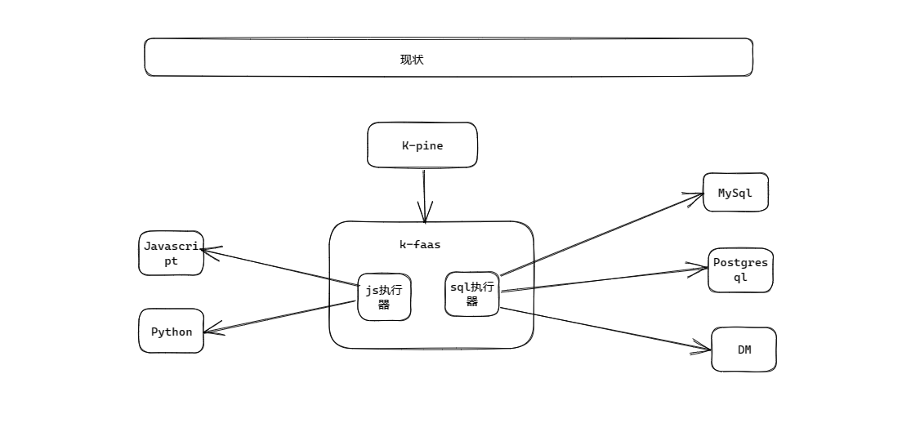
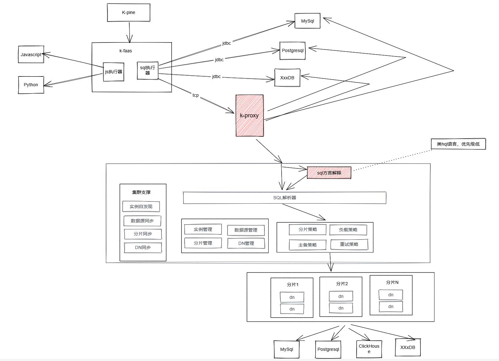

 ### 一. 市场现有方案比较

|          | ShardingSphere-Proxy               | MyCat                                | K-Proxy（目标）                                          |
| :------- | :--------------------------------- | :----------------------------------- | :------------------------------------------------------- |
| 分片     | 支持                               | 支持                                 | 支持                                                     |
| 副本     | 不支持, 依赖于后端数据库的主从集群 | 不支持, 依赖于后端数据库的主从集群   | 支持，基于sql语句同步                                    |
| 集群     | 支持，依赖Zookeeper                | 支持，依赖HAProxy                    | 支持，基于服务间通信                                     |
| Join查询 | 部分支持，基于相同分片键           | 支持，基于相同分片键，跨库采用全局表 | 支持，基于相同分片键，跨库采用全局表                     |
| K/V缓存  | 不支持                             | 不支持                               | 支持，底层采用leveldb                                    |
| 物化视图 | 不支持                             | 支持                                 | 支持，优化级低。场景可用于保存指标项的最后实时值、统计值 |
| 前端驱动 | Postgresql/MySql                   | MySql                                | MySql                                                    |
|          |                                    |                                      |                                                          |

* 全局表: 每个节点都有这个表，以及全量数据

 ### 二. 框架图

 1. 现状

 2. K-Proxy

 ### 三. 性能测试

#### 3.1 分片测试

查询语句：`select * from sys_operate_log where action like '%action_999%'`

机器： 所有节点采用docker搭建， 宿主机器为8c32g

|      | 单机(T2) | 3分片2副本(T1) |
| ---- | -------- | -------------- |
| 100W | 1441ms   | 605ms          |
| 200W | 2890ms   | 1098ms         |
| 500W | 5219ms   | 1890ms         |
|      |          |                |

> 分析:  性能本身是依赖于后端数据库本身，本中间件只是对数据进行了分片处理，  所以查询性能基本上是   T1*（N-1)  < T2 < T1 *N , 其中T1为分片的查询耗时，T2为不分片的查询耗时， N为分片数， 副本数不影响查询效率

 ### 四. 开发计划

| 序号 | 阶段       | 开发内容                  | 开始日期 | 结束日期 | 描述                                                       |
| ---- | ---------- | ------------------------- | -------- | -------- | ---------------------------------------------------------- |
| 1.1  | 开发阶段   | 前端驱动开发              | T+0      | T+5      | 对外通过jdbc提供连接，参考MyCat2的前端驱动，采用MySql驱动  |
| 1.2  | 开发阶段   | SQL解析器适配             | T+5      | T+10     | SQL解析适配Group By、Count、SUM、XXX、子查询等常用查询语句 |
| 1.3  | 开发阶段   | 策略开发/事务             | T+10     | T+15     | 内置常用的分片策略、读写策略、主备策略等, 以及事务支持     |
| 1.4  | 开发阶段   | Meta管理接口开发/KV缓存库 | T+15     | T+20     | 代理、数据源、分片表、分片策略接口开发（通过sql执行）      |
| 1.6  | 开发阶段   | 适配青松平台              | T+20     | T+30     | 适应青松平台的功能，边适配边对组件进行优化                 |
| 1.7  | 开发阶段   | 物化视图                  | T+30     | T+35     | 类似于ClickHouse，场景可用于保存指标项的最后实时值、统计值 |
| 1.8  | 开发阶段   | 集群支持                  | T+35     | T+40     | 集群支持开发                                               |
| 2.1  | 试运行阶段 | 青松平台试运行            | T+40     | T+55     | 搭建一个青松平台，让开发人员在上面开发操作                 |

