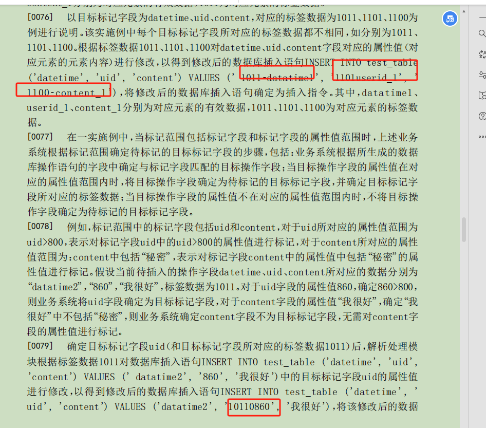

一、针对权利要求1提到的`区别技术特征为：定义层根据管理界面进行定义，数据层还用于根据索引进行数据同步。基于该区别技术特征，权利要求 1 实际解决的技术问题为：如何实现对数据的管理。`, 作出如下答复：

​	粗略看下去，《CN113704273A》和本中间件都是`发起查询`->`修改where查询语句`->`提交sql执行`，两者差别不太，但实际上，两点的方案并不太一样

1.  《CN113704273A》中提供到的标签，是直接附加到数据内容中，会对原始数据产生污染，具体可见`对比文件1-CN113704273A`中的【0076】~【0079】，而本申请专利是通过定义层，创建一个独立数据标签库，并不会对原始数据存在污染。

   

2. 《CN113704273A》需要在设计阶段提前定义好标签规则，由于其会污染到原始数据，后面一旦需求变更，标签规则变动的成本巨大，包括对已有的数据的修改，以及核心代码的变动。而本申请专利，作为一个中间件，理论上适用于所有的系统和平台，包括待开发、开发中和运行中的系统。本申请专利是通过建立好的标签库，以及对SQL进行解析，自动匹配查询，并不是简单的进行where修改；

3. 本申请专利提供更加灵活的数据权限控制特性，比如对于车辆的数据权限控制，原有需求是按销售地区进行控制，现要求添加对销售门店、生产厂商、车辆类型等维度进行控制，在此方案中，只需在定义层，增加一个字段属性，然后重新创建标签库即可。并不需要带来任何的代码变动以及需求调整等；

4. 其中提到的“通过管理界面实现，属于本领域对数据库中的数据管理的惯用技术手段”，界面管理是手段，但它的目的是为了配合建立一个独立的标签库，方便快速索引查询。本中间件作为一个整体的解决方案，这也相当重要；

   

