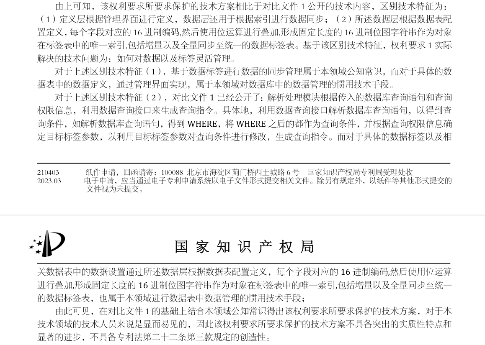
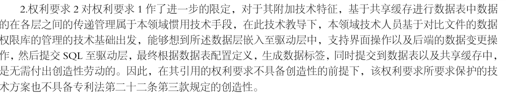
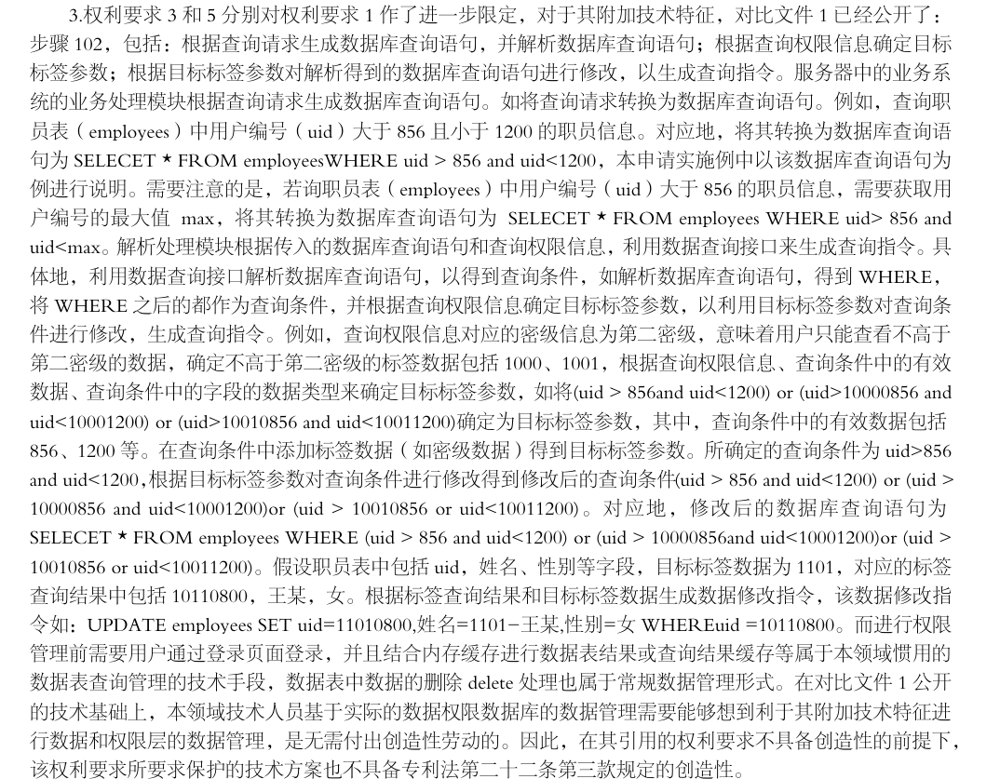
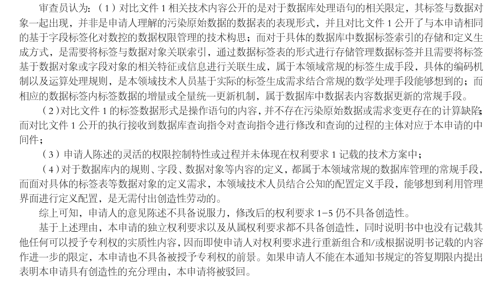

二通答复

写在最前面：

​	本发明申请的是一种数据库中间件，本质是一个自定义的驱动程序，并不是一种资源ID的编码方式。相应的，审查意见中的提到的文件 1（CN113704273A），其申请的本质的是一种ID的编码方式,即按编码规则，对uid分区，然后根据ID编码规则去查询过滤，其限制性在于预定义，即在实施前，需要将编码规则先定义好，就拿意见中提到的employees表；而本申请，是一种数据库中间件，其更注重于灵活性、通用性，即可以支持在任何系统上进行外挂使用，并不会入现有系统进行入侵。

关于第二次审查意见通知书中审查意见答复

一、意见一

答复：

1. 其中提到“对于具体的数据表中的数据定义，通过管理界面实现，属于本领域对数据库中的数据管理的惯用技术手段”，本申请中，相关定义是一种运行时阶段的维护，而目的是为了实现本中间件的灵活和通用的目标，是本申请中的必要配备。
2. 其中提到“解析数据库查询语句，得到 WHERE，将 WHERE 之后的都作为查询条件”，本人认为，不能将所有的WHERE查询语句，都归于对比文件1。因为基于上所有的SQL查询语句都会带有where。哪怕在最传统的手段中，在实现一个简单的“用户列表只能查看到其部门的用户”，都是通过在where语句中，自动拼接上其部门的过滤语句。另外，在对比文件1中，其本质就是一种ID路径化的手段，这种手段，在日常的开发实施过程中，特别是在处理树形结构中经常使用。而本申请中，采用了支持所有结构表及列进行标签化，再结合全文索引技术，支持了市面上大部分数据库以及系统，全部提升了在使用和开发过程的的通用以及灵活性，并且目前并没有类似的组件，可以做到这些，个人认为这是一种实质的创造。

二、意见二

答复：

1. 目前基本上所有的驱动都是不会带有数据数据化处理，而本发明实现过程，直接将数据权限相关的处理直接嵌入到驱动层，本质就是一种创造，只有这样处理，才能更好的避免对原有系统的强入侵性，以最小的代价满足了通用灵活的目标。

三、意见三

答复：

1. 前面所说的，不能将所有的WHERE查询语句，都归于对比文件1类似。对比文件1中实现的方式，是一种ID路径化的方式，在使用过程中存在一定的局限性。一个目标的达成，会有多种方式，可能有好多路，但不能说有了一种方式，其他方式就不具备创造性,其他的方式就不需要创造；
2. 本申请采用的方式，并以一个驱动的方式出现，这本身就是一种创造性；

四、意见四

答复：

1. 对比文件1中，对ID编码的方式，已经严格到要求别的系统如果要接入，就必须按此算法进行处理。对已经存在并运行的系统，并没有办法适用，需要大量的改造的才能适用，所以说其本质也是一种污染；
2. 本申请的中间件陈述的灵活性，因为它存在的形态，就是一个驱动，所以它是以外挂方式挂载，不会对系统进行污染。它使用的场景，可以用于已经在运行的系统进行接入，更甚于，它能用于常用的数据库客户端工具，以自定义驱动的方式连接，即可以用于数据管理。